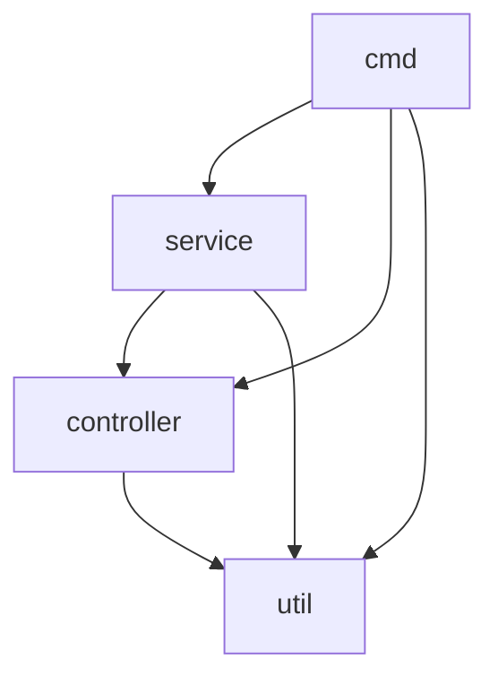

# kubernetes-proxmox-python

# Prepare the network for vm

ssh into the proxmox host

`vim /etc/network/interfaces`

Add these line to add a new NAT network with cidr `192.168.56.1/24`

```bash
auto vmbr56
iface vmbr56 inet static
        address 192.168.56.1/24
        bridge-ports none
        bridge-stp off
        bridge-fd 0
        post-up   iptables -t nat -A POSTROUTING -s '192.168.56.0/24' -o vmbr0 -j MASQUERADE
        post-down iptables -t nat -D POSTROUTING -s '192.168.56.0/24' -o vmbr0 -j MASQUERADE
```

# Prefare vm template

See [cloud-imgs](cloud-imgs/)

Login to your proxmox host as root user

Install necessary tools to build vm image

```bash
apt-get install -y cloud-init
apt-get install -y libguestfs-tools
```

Clone this repo

```bash
git clone https://github.com/tuana9a/kubernetes-proxmox-cluster-autoscaler.git
```

Build worker template

```bash
cd cloud-imgs/kube-1.27/
./build.sh
```

Build load balancer template

```bash
cd cloud-imgs/haproxy/
./build.sh
```

# Prepare the config.json

See [./examples/config.json](./examples/config.json)

# Code structure



# How to use

TODO

```bash
sudo ln -sf $cwd/.venv/bin/kp /usr/local/bin/kp
```
